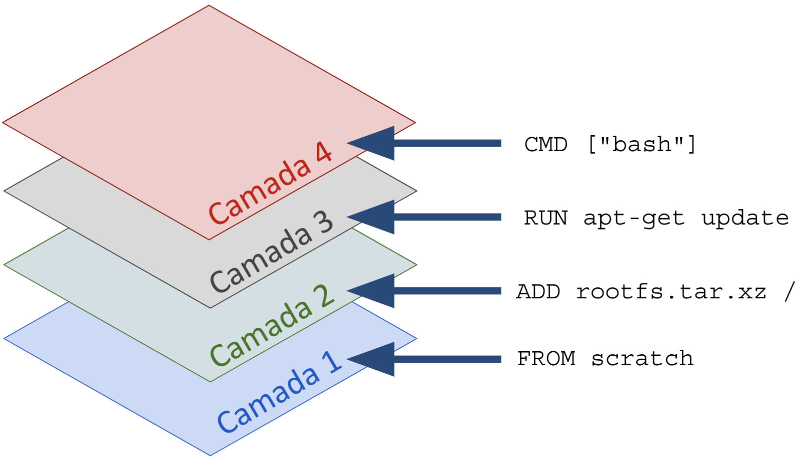

# Tech Talks Docker
---
## O que é um container?

Básicamente ele serve para isolar recursos: 
   - CPU
   - Memória 
   - Processos 
   - Network
   - etc
---
## Diferença entre VMs e Containers

---
## O que é Docker? 

É a ferramenta/solução da 2° geração dos containers, veio da evolução do LXC (Linux Containers)

Se voce quiser saber mais existe o livro Decomplicando o Docker: 

| [Link do livro](https://livro.descomplicandodocker.com.br/) | [Link do Github](https://github.com/badtuxx/DescomplicandoDocker) |

## O que é uma imagem de container? 

É uma imagem que foi criada seja por um Dockerfile (arquivo com inscruções que criam uma imagem). 

É o container que ainda não está em execução. Possui várias camadas, por exemplo: 


---
Instalando o Docker

* Linux
```sh
curl -fsSL https://get.docker.com | bash
```
* [Windows](https://docs.docker.com/desktop/install/windows-install/)

* [MacOs](https://docs.docker.com/desktop/install/mac-install/)

## Primeiros Passos
